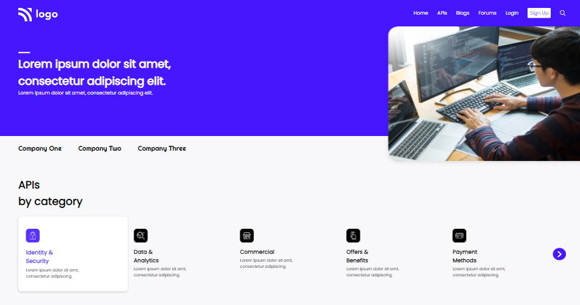
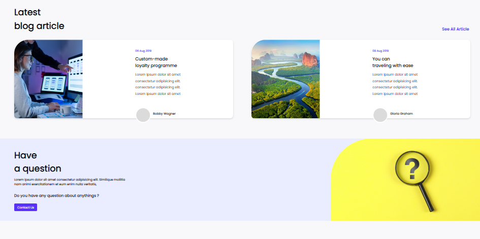
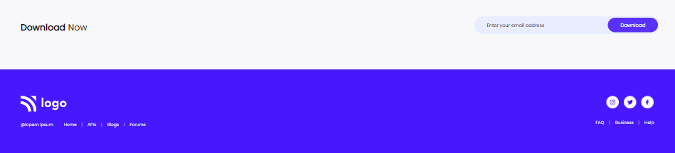

## 🔗Project 9 Link

https://project-9-live-link.netlify.app/

## ✨ Project-9: Developer Landing Page ✨

This assignment is written in **HTML5 and CSS3** which is given in **"JavaScript Full Stack Web Developer Bootcamp"** by **iNeuron**.

 

 

 

## 📌 Screenshot

 

## 📌 What I Learn

    👉 Structuring HTML and CSS.
    👉 Positions in CSS.
    👉 Various CSS Selectors like child selector, pseudo selector, nth-child selector, etc.
    👉 Flexbox in CSS.
    👉 Margin and Padding in CSS.
    👉 Box shadow in CSS.
    👉 Designing Navbar, Cards, and footer.

## I took 12-hours to build this project and 7-hours to make it responsive. I really enjoyed it 😊.

## 💬 Connect With Me

- **Email** - sainianjali1097@gmail.com

## 📌 Acknowledgments

- Course Instructor - [Hitesh Choudhary](https://github.com/hiteshchoudhary)
